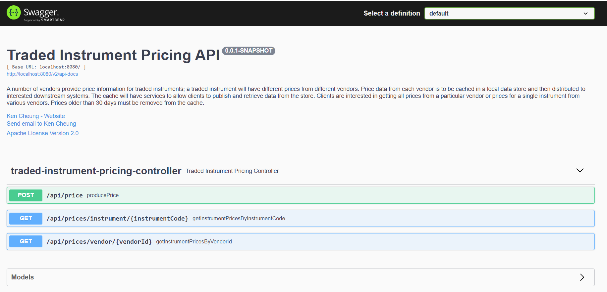

# Traded Instrument Pricing App

## What is it?

This app provides __price information for traded instruments__ to clients.
It receives the pricing information by vendors, then caches for 30days and persists in data store,
It also produces the pricing topic messages for interested downstream applications or subscribers.

## Design principle
###KISS
After discussing with the team, this project is based on the KISS principle.
###Package structure
This app follows common recommended package structure:

###Aspect-Oriented Programming
Providing a standard and consistent logging mechanism<br>
To log the every input and output of the method from packages: controller, service, datacache and util

## Source
Traded Instrument Pricing information can be provided by vendor in 2 ways:
* HTTP/REST endpoint
* .json files dropped in the drop folder

## detail
The drop Folder keep polling for the files in .json format. The app will only proceed 'NEW' files,
'OLD' files will not be proceeded again. 

The prices will be expired and evicted from the cache
after 30 days (time-to-live value is configurable).

### New pricing info will go through:
1. JSON is convert to VendorTradedInstrumentPricing domain model
2. Then it is cached into Vendor Cache (key: vendorId)
3. Then it is cached into Instrument Cache (key: instrumentCode)
4. Then it is persisted into Data Store (key: vendorId_instrumentCode_postingDataTime)
5. Finally, it is sent to the SUB topic via JMS.

### High Level Design Flow


## Domain Model (class diagram)
The entity model consists of two kinds of POJOs:

1. Request/Response DTO:
   * __TradingInstrumentPricingRequest__: binding with JSON request with bean validation annotated<br>
   * __SuccessMessage__: binding with successful response<br>
   * __ErrorMessage__: binding with error response
2. Business Domain DTO:
  * __Vendor__: Vendor information<br>
  * __Instrument__: Instrument Information<br>
  * __VendorTradingInstrumentPrice__: traded Instrument Pricing Information, it is used by cache, persist and jms layers

## Cache (provider: EhCache)
The app will hold VENDOR_CACHE and INSTRUMENT_CACHE. Cached data will be kept for 30 with max 9999 entries.
Configurable cache properties in application.properties:
```
pricing.app.cache-ttl-day=30
pricing.app.cache-max-capacity=9999
pricing.app.cache-name-vendor=VENDOR_CACHE
pricing.app.cache-name-instrument=INSTRUMENT_CACHE
```

## REST service endpoint
The app provides HTTP/REST API GET endpoints to retrieve the traded instrument pricing information
```
* GET /api/prices/vendor/{vendorId}
* GET /api/prices/instrument/{instrumentId}
```
The app provides HTTP/REST API GET endpoints to retrieve the traded instrument pricing information
```
* POST /api/price
```
### Examples
POST a new pricing<br>
  request:<br>
  `curl -X POST "http://localhost:8080/api/price" -H "accept: application/json" -H "Content-Type: application/json" -d "{ \"askPrice\": 1003.22, \"bidPrice\": 1004.67, \"currencyCode\": \"GBP\", \"instrumentCode\": \"GOOGLE\", \"instrumentDescription\": \"GOOGLE Description\", \"instrumentId\": 1001, \"txnDataTime\": \"2021-07-05T21:16:17.872Z\", \"uuid\": \"UUID-1321-5741-7049\", \"vendorId\": 1111, \"vendorName\": \"VENDOR_A\"}"`
  <br><br>
  response body:<br>
  `{
  "statusCode": 200,
  "timestamp": "2021-07-05T22:24:50.7482782",
  "message": "Operation approved",
  "body": "Traded Instrument Price has been created."
  }`


Get Prices by instrument code: GOOGLE<br>
  request:<br>
  `curl -X GET "http://localhost:8080/api/prices/instrument/GOOGLE" -H "accept: */*"`
<br><br>
  response body:<br>
  `{
  "statusCode": 200,
  "timestamp": "2021-07-05T22:31:48.5108424",
  "message": "Operation approved.",
  "body": [
  {
  "txnDataTime": "2021-07-05T21:16:17.872",
  "vendor": {
  "vendorId": 1111,
  "vendorName": "VENDOR_A"
  },
  "instrument": {
  "instrumentId": 1001,
  "instrumentCode": "GOOGLE"
  },
  "bidPrice": 1004.67,
  "askPrice": 1003.22,
  "currencyCode": "GBP",
  "key": "1111_GOOGLE_2021-07-05T21:16:17.872"
  }
  ]
  }`

Get Prices by vendor Id:<br>
  request:<br>
  `curl -X GET "http://localhost:8080/api/prices/vendor/1111" -H "accept: */*"`
  <br><br>
  response body:<br>
  `{
  "statusCode": 200,
  "timestamp": "2021-07-05T22:34:34.2909258",
  "message": "Operation approved.",
  "body": [
  {
  "txnDataTime": "2021-07-05T21:16:17.872",
  "vendor": {
  "vendorId": 1111,
  "vendorName": "VENDOR_A"
  },
  "instrument": {
  "instrumentId": 1001,
  "instrumentCode": "GOOGLE"
  },
  "bidPrice": 1004.67,
  "askPrice": 1003.22,
  "currencyCode": "GBP",
  "key": "1111_GOOGLE_2021-07-05T21:16:17.872"
  }
  ]
  }`

### API Documentation - Swagger2
http://localhost:8080/swagger-ui/index.html#/traded-instrument-pricing-controller



## Sequence Diagram
###Vendor create the traded instrument price HTTP flow


###Client get the traded instrument prices by vendor Id flow


###Client get the traded instrument prices by instrument code flow


## Vendor File Integration Flow
This integration flow shows:
1. read "NEW" vendor file in .json format for every 1 second
2. transform file into string
3. split string into single pricing json string
4. send to file_input_channel
5. activator handle the message from the channel, transform them into Pricing POJO
6. ask for pricing service layer to insertOrSave it
7. store cache and persist in data store
8. publish to topic for downstream app.


## How to run

Run the below commands from the command line:

```
unzip Traded-Instrument-Pricing-App.zip

cd Traded-Instrument-Pricing-App

./mvnw spring-boot:run
```
The command starts the Spring Boot application which includes integration flows and REST services and Swagger docs and UI for API documentation.

* REST API Endpoint - http://localhost:8080
* REST API Documentation - http://localhost:8080/swagger-ui/index.html#/price-data-controller


## Improvement / Future refinements
### LOGGING
For UAT/PROD environment, it is better to separate sensitive log from application log,
sensitive log should be accessed by approved parties.

### SECURITY
1. For PROD environment, at least TLS1.2 with strong cipher algorithm to provent eavesdropping and tampering.
2. Restrict service access, for example: using spring security for authN and authX
3. Implement Ouath2 with openID connect for 3rd party authX delegration

### PERFORMANCE
1. Performance test should be executed. It includes stress test, long running test, load test.
Other non-functional tests are also needed, for example: resilient test, operation test and security test.
<br>
2. Setup SLA level and performance metrics in terms of Throughput(tps, message/s) and end-to-end latency (ms)
<br>
3. 2-year CPU, memory, IO usage projection
4. kernel resources should be measured by long-running test, for example: semaphore, file max limit, context switch

### SCALABILITY
1. use Spring cloud API gateway. It has built-in load balance that
   will distribute requests coming from a client application equally 
   between microservices instances (robin-fashion)
   
2. Using Eureka server allows eureka clients (instances of microservice) register itself with it.
   We do not need to open Eureka configuration file and manually add the location of your microservices.
   Eureka service discovery helps us to quickly scale-up and down as needed without manually configuring.
   
3. Using Spring cloud bus helps us to push our configuration changes to all our microservices 
   and we do not need to restart anything. 
   It also to save our time to prevent from restarting processes. 
   I will use RabbitMQ as messaging middleware. 
   Also, it helps to decouple the dependencies between Spring Cloud Config Server and microservices.
   
4. provide circuit breaker to protect downstream failing (for example: call external rate exchange API)

5. Split Cache, API service, data store, message broker and integration into each self-contain services,
so that we can scale them easily and independently

### BUSINESS
1. API should provide rate exchange feature, for example, GBP -> USD
"# Traded-Instrument-Pricing-App" 
# Traded-Instrument-Pricing-App
